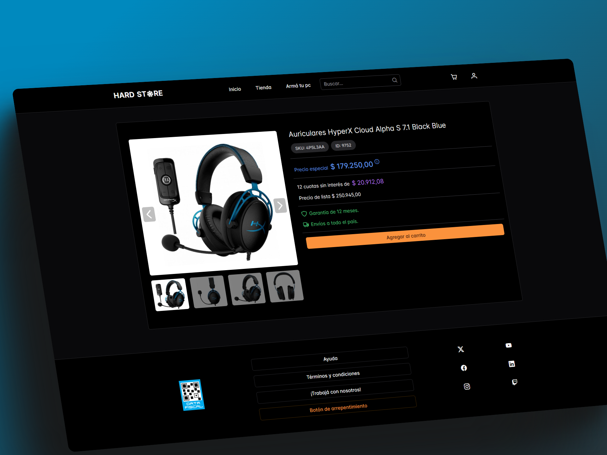
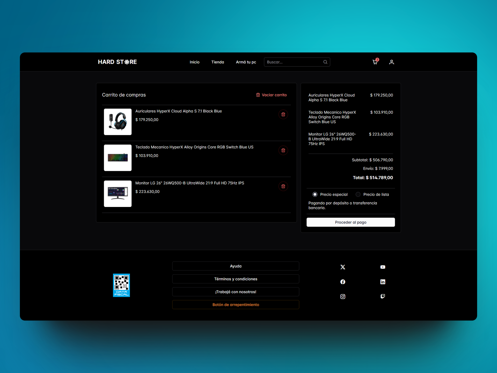

# Hard Store

 

  <a href="#features">Features</a> •
  <a href="#technologies-used">Technologies Used</a> 

 

Hard Store is an online store specializing in PC hardware, peripherals, and everything related. Developed with Angular 17, this application uses Server Side Rendering to enhance performance and SEO, managed with NgRx for efficient state management, and hosted on Firebase. The user interface is built with PrimeNG and PrimeFlex, providing a modern and responsive experience.

 

 
 

## Features

- **User Registration and Login**: Users can register and access their accounts.
- **Order and Purchase Management**: Users can manage their orders and purchase history.
- **Favorites**: Users can add products to their favorites list.
- **Product Catalog**: View the complete catalog of available products.
- **Filters and Sorting**: Filter products by categories and sort them according to various criteria.
- **Search Bar**: Quickly search for products using the search bar.
- **"Build Your PC" Section**: Step-by-step guide for selecting components and building a custom PC.

 

 

 

 

## Technologies Used

- **Angular 17**: Main framework for frontend development.
- **Server Side Rendering**: Enhances performance and SEO.
- **NgRx**: Application state management.
- **Firebase**: Backend for authentication, database, and hosting.
- **PrimeNG**: UI components for Angular.
- **PrimeFlex**: CSS utilities for responsive designs.
